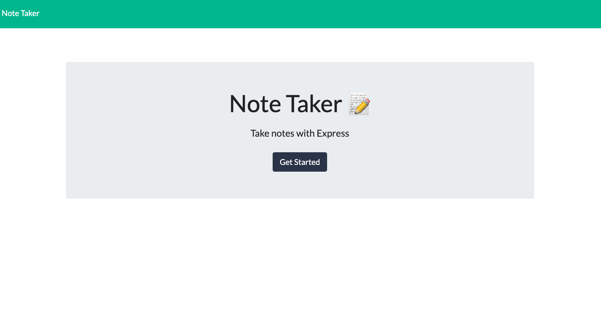
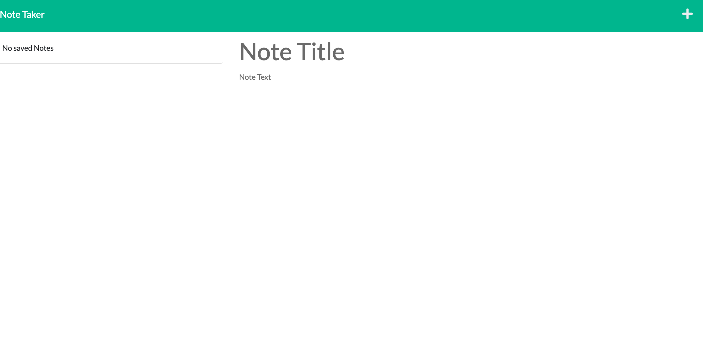
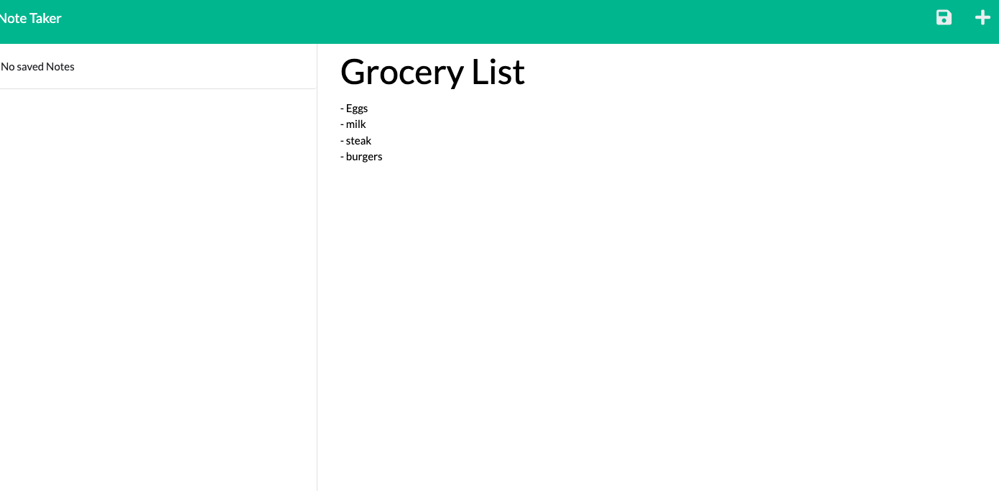
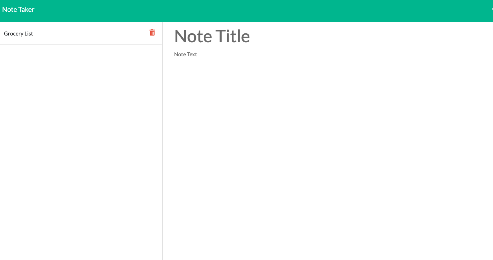

# Note Taker

## Deployed Links:
https://note-taker-seban.herokuapp.com/

## Usage
Using the command line the user should run node server.js to initiate the PORT listen.  after activating the app listening, the user should head over to http://localhost:3001 where they will be presented with the landing page.  From the landing page the user should click on the button "Get Started" where they will be rerouted to the notes page.  They are encouraged to write a title and any note they feel is important and then click the save button in the upper right corner.  If they desire to come back to the note they have written at any time, all they need to do is click on the note that they desire to see.


 






## Technologies Used
- Express.js - Express is a node js web application framework that provides broad features for building web and mobile applications. 
- Node.js - An asynchronous event-driven program to run Javascript.
- JavaScript - Allows developer to make static webpages dynamic and interactive.  For this exercise it was used to alter the original webpage to change the questions, change the answers, add a dynamic timer/countdown(that also ends the game), as well as, allow saving of scores.
- Git - Git is what I used to work on my personal computer and pushing my work to GitHub.
- GitHub - A cloud based repository that holds my saved code reserved for resetting my personal computer deployment.

## Description

The purpose of this project was to utilize our skills with Node.js and, more specifically express.js to create a note taker that responds to the fetch requests with get and post requests for both JSON and html methods.  This enhanced my outlook on server functionality and coding.

## Installation

Navigate to file using your command line and run 'npm i'. After the dependencies have been downloaded run 'node index.js' which will trigger the localhost PORT listener.  

## Lessons Learned
The most effective lessons learned for me were...
1. Using util.promisify.  
2. Writing get/post routes.


## Code Snippets
JavaScript
```javaScript
const grabDbNoteInfo = util.promisify(fs.readFile);
```
```JavaScript
app.get('/notes', (req, res) => {
  res.sendFile(path.join(__dirname, '/public/notes.html'))
});
```
```JavaScript
app.get('/api/notes', (req, res) => {
  grabDbNoteInfo('./db/db.json').then((data) => res.json(JSON.parse(data)))
});
//post request that connects to line 36 on index.js
app.post('/api/notes', (req, res) => {
  req.body.id = uuid();
  const { title, text, id } = req.body;

  if (title && text) {
    const newNotes = {
      title,
      text,
      id,
    }
    readAndAddNotes(newNotes, './db/db.json');

    const response = {
      status: "success",
      body: newNotes,
    }
    res.json(response)
  } else {
    res.json('Error in posting review');
  }
});
```
## Credits

NA

## License
Please refer to the LICENSE in the Repo.